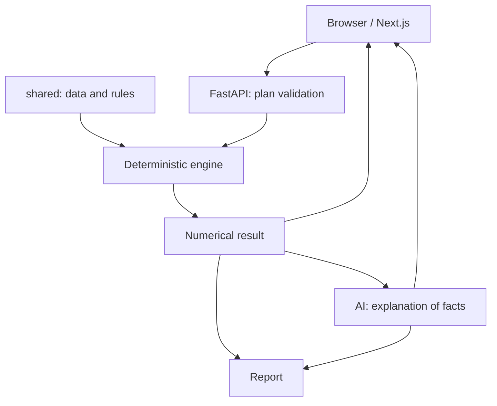

# AKIM AI — Mayor for Five Hours

**Five decisions. A budget of 100. The future of five Astana districts.**

An educational AI city-management simulator built for HackAlem by **LODZ POLSKA**.
It helps hackathon participants, analysts, and city managers compare decisions under a limited budget across transport, the environment, social infrastructure, safety, and city services.

> All data is synthetic. Results are estimates within the organizers' educational model, not forecasts of real city development. The server calculates the numbers; AI explains the calculated facts.

This is an **integrated repository**: frontend, backend, AI modules, reports, shared data, and tests are included. Clone this repository to get started; no manual merging of the team's branches is needed.

[Changes and verification](docs/LOCAL-CHANGES.md) · [Requirements coverage](docs/REQUIREMENTS.md) · [API contract](shared/api-contract.md) · [GitHub Actions](https://github.com/NuraliKuzhagaliev/akim-ai-lodz/actions/workflows/backend.yml)

## Project status

- The calculation engine, simulator UI, AI integration, plan comparison, and report exports are implemented.
- CI covers the backend, frontend, and contract consistency. [The run for original commit 14cd4db](https://github.com/NuraliKuzhagaliev/akim-ai-lodz/actions/runs/35988619762) passed on September 24, 2026.
- External AI requires your own API key. Tests using a controlled provider do not establish the quality or availability of a real model.
- No public application URL is documented in the repository's configuration or documentation. The GitHub repository is available; hosting the application is a separate step.

## Features

- A catalog of 14 measures and five districts, with district selection, search, filters, a budget tracker, and five decision slots.
- Preview calculations and server-side constraint validation; only valid plans can be finalized.
- Before/after indicators, city and district scores, the weakest district, critical values, synergies, and measure contributions.
- AI analysis of strengths, risks, trade-offs, and recommendations with supporting explanations.
- An AI advisor for incomplete plans. Each suggested addition is validated separately by the server and checked again when applied.
- The best valid improvement through **one replacement**, including district gains and losses and validated application.
- Up to 12 plans saved in the browser, numerical comparison of two plans, and a separate AI explanation of their differences.
- JSON result export and a concise AI report with Markdown preview and download.
- Responsive layouts, charts, an illustrative district map, animations, and reduced-motion support.

## How it works

1. The server loads indicators, measures, and rules from `shared/`.
2. The user selects five unique measures, assigns districts to local measures, and stays within the budget of 100.
3. The backend validates constraints, accounts for delays and synergies, and calculates district and city indicators.
4. The interface displays the result and the distribution of changes across districts.
5. For AI analysis, the server recalculates the selected decisions and passes verified facts to the model. Client-supplied numbers are not used as the calculation source.
6. The user saves the plan, evaluates one replacement, compares an alternative, and prepares a presentation report.

If AI is unavailable, calculations and plan management remain available, and the interface displays an error instead of inventing an explanation.

## Technology stack

| Component | Technologies |
| --- | --- |
| Frontend | Next.js 16.3.6, React 19.3.0, TypeScript 6.0.3, Tailwind CSS 4.3.3 |
| UI | Radix UI, Recharts, Lucide, Zod |
| Backend | Python 3.12, FastAPI, Pydantic, Uvicorn, python-dotenv |
| AI | OpenAI Python SDK, Responses API, structured responses using Pydantic schemas |
| Data | JSON catalog, deterministic Python engine, localStorage |
| Checks | pytest, Hypothesis, Ruff, Vitest, ESLint, TypeScript |
| Startup | Python launcher, npm, Dockerfiles for both services, Docker Compose |

Versions are pinned in `frontend/package-lock.json` and `backend/requirements*.txt`.
The server-side `OPENAI_MODEL` variable selects the model; the code defaults to `gpt-6-astra`. Use a model available to your API project that supports structured Responses API output. External API access and billing are not included with this project.

## Architecture

The backend validates plans and calculates indicators independently of AI. AI modules receive recalculated facts; reports combine those facts with the model's explanation.



| Path | Purpose |
| --- | --- |
| `frontend/` | Pages, components, API client, charts, and tests |
| `backend/app/simulation/` | Catalog, rules, exact calculations, and single-replacement search |
| `backend/app/api/` | HTTP routes and adapters for trusted AI requests |
| `backend/app/ai/` | Prompts, schemas, and the OpenAI provider |
| `backend/app/report/` | Reports built from facts and AI conclusions |
| `backend/tests/` | Calculation, API, and integration checks |
| `shared/` | Data, reference scenario, fixtures, contract, and OpenAPI |
| `scripts/start.py`, `START.cmd` | Installation and local service startup |
| `compose.yaml` and both Dockerfiles | Combined container startup |
| `.github/workflows/backend.yml` | Integrated automated checks |

There is no database or registration. Scenarios are stored in the current browser; `scenarioId` identifies plan content, not a server-side database record. The backend is the authoritative source of numerical results. See the [API contract](shared/api-contract.md).

## Installation and startup

### Quick start on Windows

1. Clone the repository and enter its root directory:

```powershell
git clone https://github.com/NuraliKuzhagaliev/akim-ai-lodz.git
cd akim-ai-lodz
```

   Alternatively, download the ZIP from GitHub and extract it into a separate folder.

2. Install **Python 3.12** with the Windows Launcher (`py`) and **Node.js 22.20+** with npm. Restart your terminal.
3. Open PowerShell in the project root:

```powershell
py -3.12 --version
node --version
npm.cmd --version
py -3.12 scripts/start.py
```

Alternatively, double-click **START.cmd**. The first run creates `.venv`, installs pinned dependencies, and copies local configuration examples if they do not exist. Installation requires internet access. Existing configurations and keys are preserved.

Once Next.js reports that it is ready, open **http://127.0.0.1:3000**.
API documentation: **http://127.0.0.1:8000/docs**; health endpoint: **http://127.0.0.1:8000/api/health**.
Keep the terminal open. **Ctrl+C** stops both services.

The launcher enables `live` mode, AI comparison, and recommendations, and aligns the API URL with CORS. If the default ports are occupied:

```powershell
py -3.12 scripts/start.py --api-port 8100 --web-port 3100
```

The website will then be available at `http://127.0.0.1:3100`. To build and run in production mode:

```powershell
py -3.12 scripts/start.py --production
```

Use `--install` after changing dependencies.

### Configure live AI

After the first run, open **backend/.env** in a text editor. Before the first run, you can create it by copying `backend/.env.example`:

```dotenv
OPENAI_API_KEY=your_server_side_key
OPENAI_MODEL=a_model_available_to_your_api_project
```

Restart the application. `GET /api/health` reports `aiConfigured: true` when the provider has been created. This confirms that configuration was loaded, not that external API authentication succeeded. Run an AI analysis in the interface to check actual access.

**Store the key only on the backend.** Do not put it in `frontend/.env.local`, `NEXT_PUBLIC_*` variables, a submission archive, or GitHub.
Without a key, simulation, finalization, replacement search, saving, JSON export, and numerical comparison remain available. AI advice, AI comparison, and AI reports return a clear 503 error.

### Manual startup: two terminals

On Windows, run the following in the first terminal from the repository root:

```powershell
py -3.12 -m venv .venv
.\.venv\Scripts\python.exe -m pip install -r backend/requirements-ai.txt
Copy-Item backend/.env.example backend/.env
.\.venv\Scripts\python.exe -m uvicorn app.main:app --app-dir backend --host 127.0.0.1 --port 8000
```

Copy `backend/.env` only if it does not exist, to preserve an already configured key.

In the second terminal, starting from the repository root:

```powershell
cd frontend
npm.cmd ci
Copy-Item .env.example .env.local
npm.cmd run dev
```

Copy `.env.local` only once as well. Use these values:

```dotenv
NEXT_PUBLIC_API_MODE=live
NEXT_PUBLIC_API_BASE_URL=http://127.0.0.1:8000
NEXT_PUBLIC_ENABLE_RECOMMENDATIONS=true
NEXT_PUBLIC_ENABLE_AI_COMPARISON=true
```

On macOS/Linux, install Python 3.12 and Node.js 22.20+, then run `python3.12 scripts/start.py`.
For manual startup, use `.venv/bin/python`, `cp` instead of `Copy-Item`, and `npm` instead of `npm.cmd`.

### Docker Compose

Install and start Docker with Compose v2. From the repository root:

```powershell
Copy-Item .env.example .env
docker compose up --build -d
docker compose ps
docker compose logs --tail 100 backend frontend
```

For Docker, set the AI key and model in the **root .env** before startup. Compose does not read `backend/.env`.
Website: `http://127.0.0.1:3000`; API: `http://127.0.0.1:8000`. Stop the services with `docker compose down`.

The frontend API URL must be reachable from the **browser**: `http://backend:8000` works inside the container network, but not in a user's browser. Rebuild after changing `NEXT_PUBLIC_*` values.
Dockerfiles and Compose configuration are included. CI checks Python/Node.js but does not run Docker Compose; verify the containers separately. Historical local verification notes are in [docs/LOCAL-CHANGES.md](docs/LOCAL-CHANGES.md).

## Environment variables

| Variable | Used by | Purpose |
| --- | --- | --- |
| `OPENAI_API_KEY` | Backend | Server-side key; numerical calculations work without it |
| `OPENAI_MODEL` | Backend | Structured-output model; the code defaults to `gpt-6-astra` |
| `CORS_ORIGINS` | Backend | Comma-separated allowed origins; defaults to localhost and 127.0.0.1 on port 3000 |
| `NEXT_PUBLIC_API_MODE` | Frontend | `live` for the real engine; `mock` for explicitly labeled fixtures |
| `NEXT_PUBLIC_API_BASE_URL` | Frontend | API origin without `/api`; an empty string uses the same origin |
| `NEXT_PUBLIC_ENABLE_RECOMMENDATIONS` | Frontend | Enables single-replacement search; set to `true` for the full workflow |
| `NEXT_PUBLIC_ENABLE_AI_COMPARISON` | Frontend | Enables AI comparison; set to `true` for the full workflow |

Native startup reads `backend/.env` and `frontend/.env.local`; Docker Compose takes values from the root `.env`. Process environment variables override the local backend file. The launcher sets `live` mode, addresses, CORS, and both frontend flags for the selected ports.

A model name in configuration does not guarantee access. Choose a model actually available to your API project. All `NEXT_PUBLIC_*` values become part of the client configuration and must not contain secrets.

## Main API routes

| Method | Path | Purpose |
| --- | --- | --- |
| GET | `/api/health` | Application status, data version/checksum, and AI configuration |
| GET | `/api/bootstrap` | Catalog, baseline indicators, and rules |
| GET | `/api/districts`, `/api/measures` | Districts and measures |
| POST | `/api/simulate` | Preview for 0–5 decisions |
| POST | `/api/scenario/finalize` | Finalize a complete plan |
| POST | `/api/recommend` | Find the best valid single-decision replacement |
| POST | `/api/ai/analyze`, `/api/explain` | AI analysis of a recalculated plan |
| POST | `/api/ai/advice` | Advice on individual additions to an incomplete plan |
| POST | `/api/ai/compare` | AI comparison of two recalculated plans |
| POST | `/api/report/executive-brief` | Structured report with Markdown |

Request and error formats are documented in [shared/api-contract.md](shared/api-contract.md); interactive documentation is available at `/docs`. A local measure uses `{measureId: "M7", districtId: "nura"}`; omit `districtId` for a city-wide measure.

`/api/health` does not make a paid AI test request. `aiConfigured: true` means the provider was created, not that authentication with the external service was verified.

## Deployment for external access

No ready-to-use public URL is provided. Quick start is sufficient for a demonstration on your own computer. For a public server:

1. Copy the project without `.venv`, `node_modules`, `.next`, or local secrets to a server with Python 3.12 and Node.js 22.20+.
2. Install dependencies using the manual startup commands. Set backend `OPENAI_API_KEY`, `OPENAI_MODEL`, and `CORS_ORIGINS`, for example `CORS_ORIGINS=https://akim.example.org` without a trailing `/`.
3. Before building the frontend, set `NEXT_PUBLIC_API_MODE=live`, both feature flags to `true`, and `NEXT_PUBLIC_API_BASE_URL=https://api.akim.example.org`. Replace these example addresses with your own.
4. In `frontend/`, run `npm ci`, `npm run build`, and `npm run start`. Start the backend as described in the manual instructions. Place an HTTPS reverse proxy in front of the services and configure automatic startup through your OS process manager.
5. Route website traffic to loopback port 3000 and API traffic to port 8000. Set the AI proxy timeout to at least 60 seconds. For a single domain, proxy `/api/` to the backend and build the frontend with an empty `NEXT_PUBLIC_API_BASE_URL`.
6. Restrict public access and paid AI request frequency at the proxy or gateway. The application has no authentication or rate limiting; CORS does not protect against direct requests.
7. From an external browser, verify API health, the reference scenario, CORS, and AI. Both the website and API must use HTTPS.

A domain, certificate, and hosting are not included. This README does not claim a verified public deployment.

## Verification: a demo for judges

1. Start the services, open the simulator, and load the reference scenario.
2. Check the decisions: **M7/Nura, M8/Nura, M10/Nura, M12/city-wide, M5/Saryarka**. Cost: **95**; remaining budget: **5**.
3. Finalize the plan: baseline score **52.55768**, final score **56.54307**, change **+3.98539**. The UI rounds displayed values; the API provides higher precision.
4. Inspect district indicators and AI analysis. Without a key, an AI-unavailable message should appear while numerical results remain visible.
5. Save the plan. Find the single-replacement improvement: **M5/Saryarka → M3/Nura**, cost **100**, score **57.20556**, gain **+0.66249**. Saryarka loses **1.2125** points, making the trade-off visible in the comparison.
6. Apply the replacement, finalize again, and save the second plan. Select both on the comparison page. With AI configured, use the button for explaining differences with AI.
7. Generate the executive brief on the results page and download Markdown. The JSON button exports the calculation without AI.
8. Clear the plan and request advice. Apply one suggestion; the server validates the addition again.
9. Try the incompatible M1 + M3 combination. The server should reject it. A plan cannot be finalized with fewer than five measures, duplicate measures, or an exceeded budget.

HTTP verification from the repository root in PowerShell:

```powershell
$plan = Get-Content shared/example-scenario.json -Raw
Invoke-RestMethod http://127.0.0.1:8000/api/scenario/finalize -Method Post -ContentType 'application/json' -Body $plan
```

### Automated checks

CI includes pytest with coverage, Ruff lint/format checks, contract checks, Vitest, TypeScript, ESLint, a frontend production build, and checks for up-to-date fixtures/OpenAPI. The workflow runs for changes to the backend, frontend, shared files, or the workflow itself; a root README-only change does not trigger this suite.

To repeat the checks locally, run from the repository root in PowerShell:

```powershell
.\.venv\Scripts\python.exe -m pip install -r backend/requirements-dev.txt
node backend/scripts/check_frontend_contract.mjs
.\.venv\Scripts\python.exe backend/scripts/check_ai_contract.py
Push-Location backend
..\.venv\Scripts\python.exe -m pytest -q
..\.venv\Scripts\python.exe -m ruff check app/api/simulation app/models app/simulation app/main.py tests scripts
..\.venv\Scripts\python.exe -m ruff format --check app/api/simulation app/models app/simulation app/main.py tests scripts
Pop-Location
Push-Location frontend
npm.cmd test
npm.cmd run typecheck
npm.cmd run lint
npm.cmd run build
Pop-Location
```

One pytest test for payload exchange between Node and Python is skipped by default. To enable it, set this before the contract check and pytest:
`$env:AKIM_FRONTEND_REQUEST = Join-Path $env:TEMP 'akim-frontend-request.json'`.
Do not set `NEXT_PUBLIC_API_MODE=live` through shell variables during unit tests: some tests intentionally exercise demo mode, and Vitest does not load `.env.local`.

## Data and integrations

The source is the organizers' district dataset PDF. `shared/districts.json` contains ten indicators for five districts and population shares; `shared/measures.json` contains 14 measures, costs, effects, and delays; `shared/model.json` contains weights, constraints, synergies, and penalties. The application does not need the original PDFs at runtime.

The horizon is 8 quarters, with effects scaled by `(8 − lag) / 8`. Effects and synergies are added before values are clamped to 0–100. The final score is:
`0.7 × population-weighted city score + 0.3 × minimum district score − number of indicators below 40`.
Internal calculations use exact fractions without intermediate rounding.
A finalized plan must contain exactly five unique measures, at most two in one category, at least three categories, and a total cost of no more than 100.

The external integration is the OpenAI Responses API. Government APIs, live geographic data, and real registries are not connected. The district map is illustrative.

## What makes the project useful

- **District equity:** the weakest district and critical indicators appear alongside the average result.
- **Explainable replacements:** a single-decision improvement shows gains and losses for specific districts.
- **Decision justification:** AI compares two recalculated plans, while the report combines facts with an explanation of trade-offs.

## Limitations

- No shared team leaderboard, random events, or ready-made PPT/PDF export. These are optional in the brief; reports download as Markdown.
- No multi-user database, cross-device synchronization, authentication, or AI request rate limiting.
- Single-replacement search does not prove global optimality.
- AI requires a valid key, an available model, and internet access; its text may contain errors. Code checks numbers and plan validity.
- The backend waits up to 45 seconds for AI without automatic retries; the UI waits up to 60 seconds. Retry manually.
- `mock` is a separate fixture mode: it does not calculate arbitrary plans, and example text is labeled as a template. Use `live` for full verification.
- CI with a test AI provider verifies integration and contracts. Real paid AI, Docker Compose, and public hosting require separate checks.

## Origin and development

Built by **LODZ POLSKA** for HackAlem. [Original team repository](https://github.com/BAITC-Hacks/hack-921839cc-lodz-polska); the current integrated version is hosted at [NuraliKuzhagaliev/akim-ai-lodz](https://github.com/NuraliKuzhagaliev/akim-ai-lodz).

Module ownership and feature-branch rules are documented in [AGENTS.md](AGENTS.md). [docs/LOCAL-CHANGES.md](docs/LOCAL-CHANGES.md) and other integration notes describe the history of preparing the build; current startup commands are provided above. Linked supporting documents may remain in Russian.

## License

There is no `LICENSE` file in the current repository. Source reuse terms are not explicitly defined.
